# SyncForge

**SyncForge** is a production-shaped realtime collaboration backend built with Java, Spring Boot, PostgreSQL, Redis Streams, WebSockets, Flyway, JDBC, Testcontainers, and Docker Compose.

It started as a room-based WebSocket collaboration backend and grew into a failure-tested distributed collaboration system with ordered operations, durable replay, offline edit safety, text convergence, bounded replay, compaction, room ownership leases, fencing tokens, runtime repair controls, and a Jepsen-lite failure matrix.

The project is intentionally backend-only. It is not a frontend editor, not a generic event bus, not a CRDT library, and not a toy WebSocket demo.

It exists to answer a hard backend question:

> How do you build a realtime collaborative room backend where clients can disconnect, retry, edit offline, reconnect to a different node, survive stale owners, replay from durable truth, compact history, and recover from bad runtime state without losing accepted operations or leaking data?

---

## Table of Contents

* [What SyncForge Proves](#what-syncforge-proves)
* [Current Backend Status](#current-backend-status)
* [Architecture at a Glance](#architecture-at-a-glance)
* [Core System Principles](#core-system-principles)
* [Tech Stack](#tech-stack)
* [Repository Layout](#repository-layout)
* [Quick Start](#quick-start)
* [Running the Backend](#running-the-backend)
* [Two-Node Runtime Proof](#two-node-runtime-proof)
* [Configuration](#configuration)
* [Domain Model](#domain-model)
* [Main Runtime Flows](#main-runtime-flows)
* [WebSocket Protocol](#websocket-protocol)
* [REST API Catalogue](#rest-api-catalogue)
* [Data Model and Migrations](#data-model-and-migrations)
* [Operation Correctness Model](#operation-correctness-model)
* [Text Convergence Model](#text-convergence-model)
* [Delivery Truth and Redis Streams](#delivery-truth-and-redis-streams)
* [Offline Operation Safety](#offline-operation-safety)
* [Resume, Snapshot Refresh, Bounded Replay, and Compaction](#resume-snapshot-refresh-bounded-replay-and-compaction)
* [Room Ownership, Leases, Fencing, and Failover](#room-ownership-leases-fencing-and-failover)
* [Runtime Control Plane](#runtime-control-plane)
* [Consistency Verification and Repair](#consistency-verification-and-repair)
* [Failure Testing and Jepsen-Lite Matrix](#failure-testing-and-jepsen-lite-matrix)
* [Testing Strategy](#testing-strategy)
* [Verification Commands](#verification-commands)
* [Operational Playbooks](#operational-playbooks)
* [Known Boundaries](#known-boundaries)
* [Final Backend Feature Stop Line](#final-backend-feature-stop-line)

---

## What SyncForge Proves

SyncForge demonstrates a backend architecture for realtime collaborative state, including:

* **Room membership and permissions**
* **WebSocket room lifecycle**
* **Presence and awareness**
* **Client operation envelope**
* **Server-assigned ordered room sequence**
* **Durable accepted operation log**
* **ACK / NACK operation protocol**
* **Duplicate-safe operation submit**
* **Protocol version negotiation**
* **Client capability negotiation**
* **Offline operation submission and causal validation**
* **Stable text atom identity**
* **Insert-after collaborative text model**
* **Tombstone deletes**
* **Visible text materialization**
* **Replay determinism**
* **Snapshot + active tail replay**
* **Resume windows**
* **Snapshot refresh semantics**
* **Operation compaction**
* **Redis Streams event fanout**
* **Delivery truth through an outbox**
* **Slow consumer / flow control safeguards**
* **Room backpressure**
* **Room ownership leases**
* **Fencing tokens**
* **Stale owner rejection**
* **Failover safety**
* **Runtime health and invariant verification**
* **Pause / resume writes**
* **Force resync generation**
* **Delivery drain controls**
* **Poison operation quarantine**
* **Repair / rebuild from canonical truth**
* **Permission-removal data-leak regressions**
* **Two-node Docker Compose runtime proof**
* **Jepsen-lite deterministic failure matrix**

The main engineering claim is:

> Accepted operations are canonical. Delivery may fail, Redis may duplicate events, clients may retry, nodes may lose ownership, and clients may reconnect later, but canonical state remains replayable, bounded, permission-safe, and repairable.

---

## Current Backend Status

Backend feature work is intentionally complete.

| Range        |   Status | Main capability                                                     |
| ------------ | -------: | ------------------------------------------------------------------- |
| SYNC-000–015 | Complete | Foundation, rooms, WebSocket gateway, presence, operation protocol  |
| SYNC-016–025 | Complete | Document state, conflict detection, snapshots, resume/backfill      |
| SYNC-026–035 | Complete | Flow control, rate limits, backpressure, Redis Streams, node fanout |
| SYNC-036–045 | Complete | Harnesses, fuzz tests, invariants, permission regressions           |
| SYNC-046–055 | Complete | Protocol versioning, capability negotiation, compatibility gates    |
| SYNC-056–065 | Complete | Delivery truth, outbox, Redis retry, stream consumer idempotency    |
| SYNC-066–075 | Complete | Offline envelope, idempotency, causal dependency validation         |
| SYNC-076–088 | Complete | Text convergence, stable IDs, tombstones, replay/snapshot proof     |
| SYNC-089–098 | Complete | Resume windows, snapshot refresh, bounded replay, compaction API    |
| SYNC-099–108 | Complete | Room ownership, leases, fencing tokens, failover safety             |
| SYNC-109–124 | Complete | Runtime health, verifier, controls, repair, disaster proof          |
| SYNC-125–140 | Complete | Two-node runtime proof and Jepsen-lite failure matrix               |

---

## Architecture at a Glance

### System Context

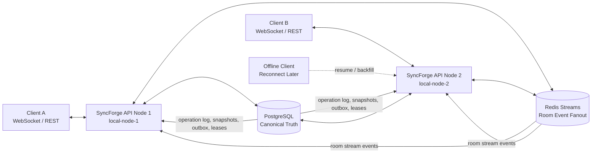

### Backend Module Map

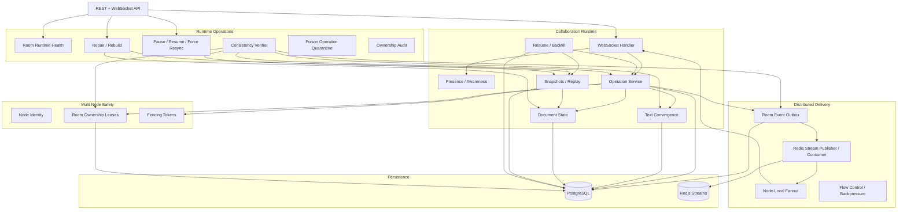

### Source of Truth Model

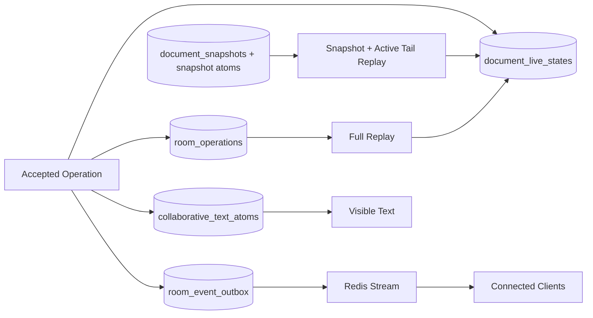

The important rule:

> PostgreSQL is canonical truth. Redis is delivery. WebSocket fanout is live transport. Resume/backfill repairs missed delivery.

---

## Core System Principles

### 1. PostgreSQL is canonical truth

Accepted operations, document state, snapshots, outbox rows, room leases, fencing tokens, compaction runs, and runtime controls live in PostgreSQL.

Redis Streams are not the source of truth. They are a fanout and delivery mechanism.

### 2. Accepted operation means durable commitment

An operation is not “real” because a WebSocket message was sent.

It becomes real when it is accepted into canonical storage and assigned a server room sequence.

### 3. Room sequence is server authority

Clients send `clientSeq`, `baseRevision`, and operation IDs.

The server assigns canonical `roomSeq` and revision.

This prevents clients from creating their own global order.

### 4. Duplicate retries must be safe

Clients can retry operations after disconnects, timeouts, offline replay, or network failures.

A duplicate semantic retry returns the original accepted result. A duplicate ID with changed payload is rejected.

### 5. Delivery is separate from correctness

An operation can be accepted even if Redis publishing fails later.

The outbox preserves delivery intent. Dispatch can retry or be drained manually.

### 6. Replay must repair delivery gaps

Clients may miss Redis/WebSocket events.

Resume/backfill uses DB truth and room sequence, not Redis Stream retention, to catch clients up.

### 7. Text convergence is deterministic

Collaborative text uses stable atoms/spans, insert-after semantics, deterministic ordering, and tombstones.

The project does not claim to be a full academic CRDT or Google Docs clone.

It is a pragmatic, deterministic collaborative text model.

### 8. History cannot grow forever

Snapshots, resume windows, bounded replay, and compaction prevent unbounded replay from the beginning of time.

### 9. Multi-node writes need fencing

Only the current room owner with the current fencing token can append and publish room events.

Stale owners are rejected before mutation.

### 10. Production systems need repair paths

The runtime layer can inspect health, verify invariants, pause writes, force resync, drain delivery, quarantine poison operations, and rebuild room state from canonical truth.

---

## Tech Stack

| Layer              | Technology                                |
| ------------------ | ----------------------------------------- |
| Language           | Java 21                                   |
| Framework          | Spring Boot 3.5.x                         |
| Build              | Maven Wrapper                             |
| HTTP API           | Spring Web                                |
| WebSocket API      | Spring WebSocket                          |
| Persistence        | PostgreSQL                                |
| Migrations         | Flyway                                    |
| Data access        | Spring JDBC / SQL-first repositories      |
| Event fanout       | Redis Streams                             |
| Runtime health     | Spring Actuator                           |
| Tests              | JUnit 5, Spring Boot Test, Testcontainers |
| Local runtime      | Docker Compose                            |
| Architecture style | Modular monolith                          |

Intentionally not used:

* JPA/Hibernate
* Kafka
* RabbitMQ
* NATS
* Kubernetes
* Terraform
* Frontend framework
* External CRDT library
* OAuth/JWT auth system

Those are omitted intentionally to keep the project focused on realtime collaboration correctness rather than infrastructure sprawl.

---

## Repository Layout

```text
sync-forge/
├── README.md
├── .github/
│   └── workflows/
│       └── backend-platform-hardening.yml
├── apps/
│   └── api/
│       ├── pom.xml
│       ├── Dockerfile
│       ├── mvnw
│       ├── mvnw.cmd
│       └── src/
│           ├── main/
│           │   ├── java/com/syncforge/api/
│           │   │   ├── awareness/
│           │   │   ├── backpressure/
│           │   │   ├── capability/
│           │   │   ├── connection/
│           │   │   ├── delivery/
│           │   │   ├── documentstate/
│           │   │   ├── identity/
│           │   │   ├── node/
│           │   │   ├── operation/
│           │   │   ├── ownership/
│           │   │   ├── presence/
│           │   │   ├── protocol/
│           │   │   ├── ratelimit/
│           │   │   ├── resume/
│           │   │   ├── room/
│           │   │   ├── runtime/
│           │   │   ├── shared/
│           │   │   ├── snapshot/
│           │   │   ├── stream/
│           │   │   ├── text/
│           │   │   └── websocket/
│           │   └── resources/
│           │       ├── application.yml
│           │       └── db/migration/
│           └── test/
│               └── java/com/syncforge/api/
└── infra/
    └── docker-compose/
        ├── docker-compose.yml
        ├── docker-compose.two-node.yml
        └── smoke-two-node-runtime.sh
```

---

## Quick Start

### Prerequisites

* Java 21
* Docker Desktop or Docker Engine
* Git
* Bash or PowerShell

### Validate Docker Compose

```bash
docker compose -f infra/docker-compose/docker-compose.yml config
```

### Run tests

```bash
cd apps/api
./mvnw test
```

On Windows:

```powershell
cd apps/api
.\mvnw.cmd test
```

### Compile

```bash
cd apps/api
./mvnw -DskipTests compile
```

On Windows:

```powershell
cd apps/api
.\mvnw.cmd -DskipTests compile
```

### Start the single-node runtime

```bash
docker compose -f infra/docker-compose/docker-compose.yml up -d --build
```

### Check runtime health

```bash
curl http://localhost:8080/actuator/health
curl http://localhost:8080/actuator/health/readiness
curl http://localhost:8080/api/v1/system/ping
curl http://localhost:8080/api/v1/system/node
```

### Stop runtime

```bash
docker compose -f infra/docker-compose/docker-compose.yml down -v
```

---

## Running the Backend

### Single-node local runtime

The default Compose runtime starts:

* `syncforge-postgres`
* `syncforge-redis`
* `syncforge-api`

```bash
docker compose -f infra/docker-compose/docker-compose.yml up -d --build
```

Default API port:

```text
http://localhost:8080
```

Useful checks:

```bash
curl -s http://localhost:8080/actuator/health
curl -s http://localhost:8080/actuator/health/readiness
curl -s http://localhost:8080/api/v1/system/ping
curl -s http://localhost:8080/api/v1/system/node
```

Shutdown:

```bash
docker compose -f infra/docker-compose/docker-compose.yml down -v
```

---

## Two-Node Runtime Proof

SyncForge includes a dedicated two-node Compose file.

```bash
docker compose -f infra/docker-compose/docker-compose.two-node.yml config
```

Start both API nodes:

```bash
docker compose -f infra/docker-compose/docker-compose.two-node.yml up -d --build
```

Expected services:

| Service              |   Port | Node ID              |
| -------------------- | -----: | -------------------- |
| `syncforge-api-1`    | `8080` | `local-node-1`       |
| `syncforge-api-2`    | `8081` | `local-node-2`       |
| `syncforge-postgres` | `5432` | shared DB            |
| `syncforge-redis`    | `6379` | shared stream broker |

Check node 1:

```bash
curl -s http://localhost:8080/actuator/health
curl -s http://localhost:8080/actuator/health/readiness
curl -s http://localhost:8080/api/v1/system/ping
curl -s http://localhost:8080/api/v1/system/node
```

Check node 2:

```bash
curl -s http://localhost:8081/actuator/health
curl -s http://localhost:8081/actuator/health/readiness
curl -s http://localhost:8081/api/v1/system/ping
curl -s http://localhost:8081/api/v1/system/node
```

Run the smoke proof:

```bash
./infra/docker-compose/smoke-two-node-runtime.sh
```

The smoke script validates two-node Compose, starts both nodes, waits for readiness, checks health/ping/node endpoints, verifies node IDs, and shuts the stack down.

---

## Configuration

Main application config lives in:

```text
apps/api/src/main/resources/application.yml
```

### Database

| Environment variable    | Default                                      |
| ----------------------- | -------------------------------------------- |
| `SYNCFORGE_DB_URL`      | `jdbc:postgresql://localhost:5432/syncforge` |
| `SYNCFORGE_DB_USER`     | `syncforge`                                  |
| `SYNCFORGE_DB_PASSWORD` | `syncforge`                                  |

### Redis

| Environment variable   | Default     |
| ---------------------- | ----------- |
| `SYNCFORGE_REDIS_HOST` | `localhost` |
| `SYNCFORGE_REDIS_PORT` | `6379`      |

### Node identity

| Environment variable                   | Default        |
| -------------------------------------- | -------------- |
| `SYNCFORGE_NODE_ID`                    | `local-node-1` |
| `SYNCFORGE_NODE_HEARTBEAT_TTL_SECONDS` | `30`           |

### WebSocket flow control

| Environment variable                                | Default |
| --------------------------------------------------- | ------: |
| `SYNCFORGE_WEBSOCKET_MAX_OUTBOUND_QUEUE_SIZE`       |   `100` |
| `SYNCFORGE_WEBSOCKET_SLOW_CONSUMER_QUEUED_MESSAGES` |    `80` |
| `SYNCFORGE_WEBSOCKET_SEND_TIMEOUT_MS`               |   `500` |
| `SYNCFORGE_WEBSOCKET_QUARANTINE_TTL_SECONDS`        |    `60` |

### Rate limits

| Environment variable                                           | Default |
| -------------------------------------------------------------- | ------: |
| `SYNCFORGE_RATE_LIMIT_OPERATIONS_PER_CONNECTION_PER_SECOND`    |    `20` |
| `SYNCFORGE_RATE_LIMIT_OPERATIONS_PER_USER_PER_ROOM_PER_MINUTE` |   `300` |

### Room backpressure

| Environment variable                             | Default |
| ------------------------------------------------ | ------: |
| `SYNCFORGE_BACKPRESSURE_MAX_ROOM_PENDING_EVENTS` |  `1000` |
| `SYNCFORGE_BACKPRESSURE_WARNING_PENDING_EVENTS`  |   `800` |

### Redis Streams

| Environment variable                      | Default                  |
| ----------------------------------------- | ------------------------ |
| `SYNCFORGE_REDIS_STREAM_ROOM_KEY_PREFIX`  | `syncforge:room-events:` |
| `SYNCFORGE_REDIS_STREAM_MAXLEN`           | `10000`                  |
| `SYNCFORGE_REDIS_STREAM_CONSUMER_POLL_MS` | `100`                    |
| `SYNCFORGE_REDIS_STREAM_ENABLED`          | `true`                   |

---

## Domain Model

### Main domain concepts

| Concept         | Meaning                                        |
| --------------- | ---------------------------------------------- |
| Workspace       | Tenant-like boundary that owns documents       |
| User            | Actor participating in rooms                   |
| Document        | Collaborative document root                    |
| Room            | Live collaboration space for a document        |
| Room membership | Permission grant for a user in a room          |
| Connection      | WebSocket connection/session identity          |
| Presence        | Online/offline room participation state        |
| Awareness       | Cursor/selection ephemeral state               |
| Operation       | Client-submitted document mutation             |
| Room sequence   | Server-assigned canonical ordering number      |
| Document state  | Current materialized visible state             |
| Text atom       | Stable identity unit for collaborative text    |
| Snapshot        | Saved replay baseline                          |
| Outbox event    | Durable delivery intent for accepted operation |
| Resume token    | Reconnect/backfill authorization artifact      |
| Room lease      | DB-backed owner-node authority record          |
| Fencing token   | Monotonic room ownership generation            |
| Runtime control | Pause/resync/repair state for a room           |

### Permission model

Room permissions support the main role distinction:

| Capability                | Owner / manage-level |        Editor |        Viewer | Non-member / removed |
| ------------------------- | -------------------: | ------------: | ------------: | -------------------: |
| Join room                 |                  yes |           yes |           yes |                   no |
| View document state       |                  yes |           yes |           yes |                   no |
| Send awareness            |                  yes |           yes |           yes |                   no |
| Submit edit operation     |                  yes |           yes |            no |                   no |
| Resume/backfill           |                  yes |           yes |           yes |                   no |
| Snapshot refresh          |                  yes |           yes |           yes |                   no |
| Runtime health/invariants |                  yes | no by default | no by default |                   no |
| Pause/resume writes       |                  yes |            no |            no |                   no |
| Force resync              |                  yes |            no |            no |                   no |
| Delivery drain            |                  yes |            no |            no |                   no |
| Repair/rebuild            |                  yes |            no |            no |                   no |
| Compaction preview/run    |                  yes |            no |            no |                   no |

---

## Main Runtime Flows

### Operation Submit Flow

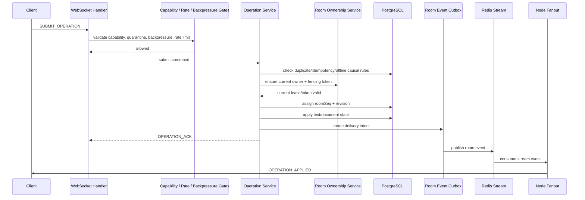

### Rejected Operation Flow

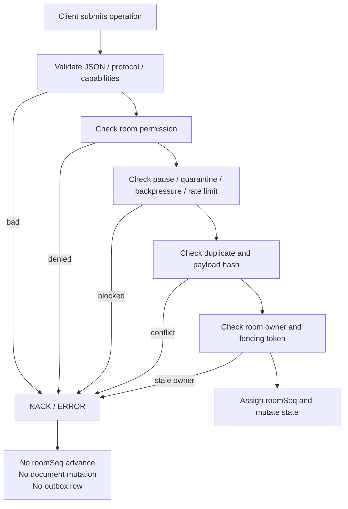

### Delivery Truth Flow

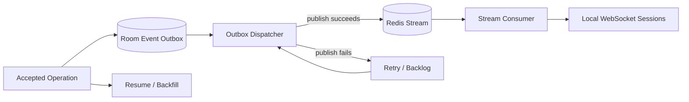

Delivery can fail and still be recoverable because accepted operations are stored in DB before fanout.

### Resume / Snapshot Refresh Flow

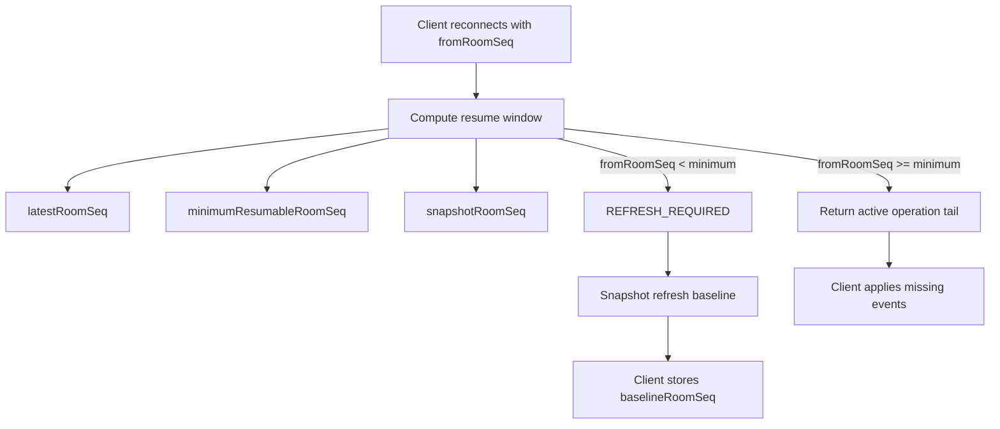

### Snapshot + Active Tail Replay

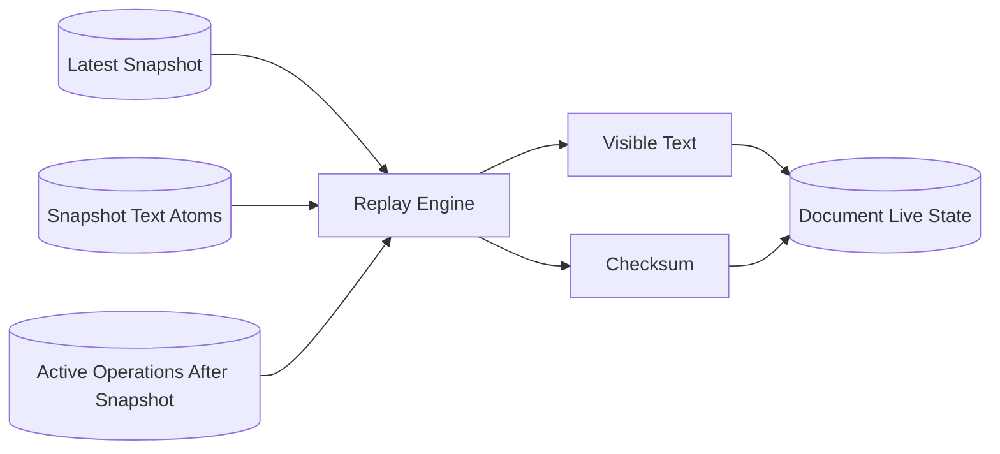

### Ownership / Fencing Flow

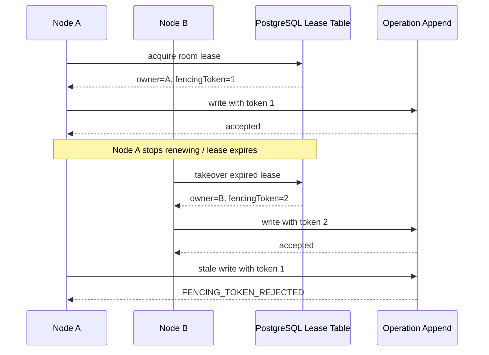

### Repair Flow

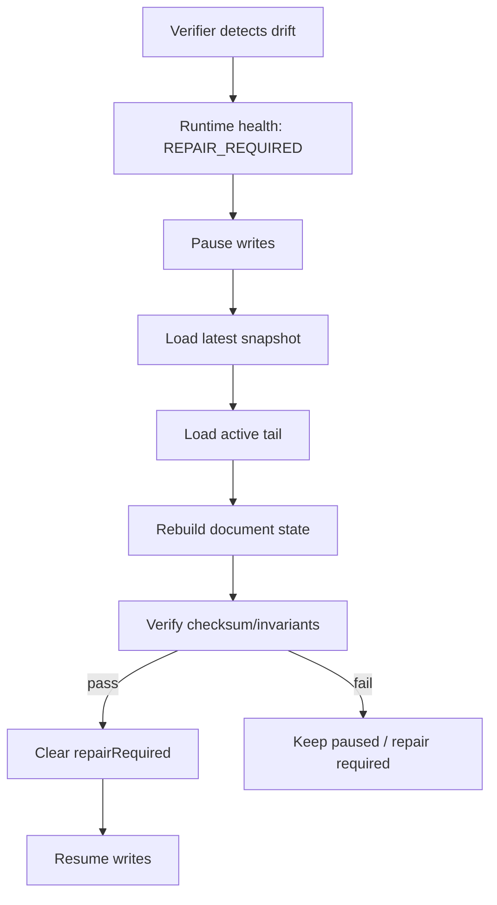

---

## WebSocket Protocol

Endpoint:

```text
/ws/rooms
```

### Handshake headers

Typical WebSocket handshake expects user/session identity headers such as:

```text
X-User-Id: <uuid>
X-Device-Id: <device-id>
X-Client-Session-Id: <client-session-id>
```

### Envelope shape

```json
{
  "type": "JOIN_ROOM",
  "messageId": "client-message-id",
  "roomId": "room-uuid",
  "connectionId": null,
  "payload": {}
}
```

### Client messages

| Type                 | Purpose                                                            |
| -------------------- | ------------------------------------------------------------------ |
| `JOIN_ROOM`          | Join a room, negotiate protocol/capabilities, receive resume token |
| `LEAVE_ROOM`         | Leave the current room                                             |
| `PING`               | Keep connection active and update presence                         |
| `HEARTBEAT`          | Refresh liveness/presence TTL                                      |
| `CURSOR_UPDATE`      | Update cursor awareness state                                      |
| `SELECTION_UPDATE`   | Update selection awareness state                                   |
| `SUBMIT_OPERATION`   | Submit text/document operation                                     |
| `GET_DOCUMENT_STATE` | Get current document state                                         |
| `ACK_ROOM_EVENT`     | Acknowledge received room event sequence                           |
| `RESUME_ROOM`        | Resume room after disconnect using resume token                    |

### Server messages

| Type                    | Purpose                                     |
| ----------------------- | ------------------------------------------- |
| `JOINED_ROOM`           | Join accepted; includes state/resume token  |
| `PROTOCOL_NEGOTIATED`   | Protocol/capability negotiation result      |
| `PROTOCOL_REJECTED`     | Unsupported protocol rejected               |
| `LEFT_ROOM`             | Leave accepted                              |
| `PONG`                  | Ping/heartbeat response                     |
| `ERROR`                 | Generic protocol/runtime error              |
| `PRESENCE_JOINED`       | User connection joined room                 |
| `PRESENCE_LEFT`         | User connection left room                   |
| `PRESENCE_UPDATED`      | Presence refreshed                          |
| `PRESENCE_SNAPSHOT`     | Current presence view                       |
| `AWARENESS_UPDATED`     | Cursor/selection state changed              |
| `OPERATION_ACK`         | Operation accepted                          |
| `OPERATION_NACK`        | Operation rejected                          |
| `OPERATION_APPLIED`     | Operation applied/fanout event              |
| `DOCUMENT_STATE`        | Current visible document state              |
| `ROOM_EVENT_ACKED`      | ACK_ROOM_EVENT accepted                     |
| `ROOM_RESUMED`          | Resume accepted                             |
| `ROOM_BACKFILL`         | Missed events returned                      |
| `RESYNC_REQUIRED`       | Client too stale; full refresh needed       |
| `RATE_LIMITED`          | Operation limit exceeded                    |
| `BACKPRESSURE_WARNING`  | Room under event pressure                   |
| `SLOW_CONSUMER_WARNING` | Connection falling behind                   |
| `SESSION_QUARANTINED`   | Connection isolated due to slow consumption |

### Example join

```json
{
  "type": "JOIN_ROOM",
  "messageId": "msg-1",
  "roomId": "00000000-0000-0000-0000-000000000001",
  "payload": {
    "clientId": "web-client-1",
    "protocolVersion": 1,
    "capabilities": ["OPERATIONS", "AWARENESS", "RESUME", "BACKFILL", "SNAPSHOT"]
  }
}
```

### Example submit operation

```json
{
  "type": "SUBMIT_OPERATION",
  "messageId": "msg-2",
  "roomId": "00000000-0000-0000-0000-000000000001",
  "payload": {
    "operationId": "op-123",
    "clientSeq": 1,
    "baseRevision": 0,
    "baseRoomSeq": 0,
    "operationType": "TEXT_INSERT_AFTER",
    "operation": {
      "anchorAtomId": "START",
      "text": "Hello"
    },
    "offline": false,
    "clientOperationId": "client-op-123",
    "dependsOnRoomSeq": 0,
    "dependsOnOperationIds": [],
    "canonicalPayloadHash": null
  }
}
```

---

## REST API Catalogue

### System endpoints

| Method | Path                         | Purpose                      |
| ------ | ---------------------------- | ---------------------------- |
| `GET`  | `/api/v1/system/ping`        | Basic application ping       |
| `GET`  | `/api/v1/system/node`        | Current node identity/status |
| `GET`  | `/actuator/health`           | Spring health endpoint       |
| `GET`  | `/actuator/health/readiness` | Readiness probe              |

### Room endpoints

| Method | Path                                                            | Purpose                      |
| ------ | --------------------------------------------------------------- | ---------------------------- |
| `POST` | `/api/v1/workspaces/{workspaceId}/documents/{documentId}/rooms` | Create a room for a document |
| `GET`  | `/api/v1/rooms/{roomId}`                                        | Fetch room details           |

### Resume endpoints

| Method | Path                                                              | Purpose                           |
| ------ | ----------------------------------------------------------------- | --------------------------------- |
| `GET`  | `/api/v1/rooms/{roomId}/resume?userId={userId}&fromRoomSeq={seq}` | Resume from a known room sequence |
| `GET`  | `/api/v1/rooms/{roomId}/resume/snapshot-refresh?userId={userId}`  | Full safe baseline refresh        |

### Compaction endpoints

| Method | Path                                                           | Purpose                       |
| ------ | -------------------------------------------------------------- | ----------------------------- |
| `GET`  | `/api/v1/rooms/{roomId}/operations/compaction?userId={userId}` | Preview safe compaction state |
| `POST` | `/api/v1/rooms/{roomId}/operations/compaction?userId={userId}` | Run safe operation compaction |

### Runtime endpoints

All runtime endpoints are under:

```text
/api/v1/rooms/{roomId}/runtime
```

| Method | Path                                            | Purpose                            |
| ------ | ----------------------------------------------- | ---------------------------------- |
| `GET`  | `/runtime?userId={userId}`                      | Consolidated runtime overview      |
| `GET`  | `/runtime/health?userId={userId}`               | Room runtime health                |
| `GET`  | `/runtime/invariants?userId={userId}`           | Consistency verifier snapshot      |
| `POST` | `/runtime/pause?userId={userId}`                | Pause room writes                  |
| `POST` | `/runtime/resume-writes?userId={userId}`        | Resume room writes                 |
| `POST` | `/runtime/force-resync?userId={userId}`         | Increment force-resync generation  |
| `GET`  | `/runtime/delivery?userId={userId}`             | Delivery/outbox status             |
| `POST` | `/runtime/delivery/drain?userId={userId}`       | Drain pending/retry delivery       |
| `GET`  | `/runtime/poison-operations?userId={userId}`    | List quarantined poison operations |
| `POST` | `/runtime/repair/rebuild-state?userId={userId}` | Rebuild state from canonical truth |
| `GET`  | `/runtime/ownership-audit?userId={userId}`      | Ownership/fencing audit            |

Runtime mutation endpoints accept optional request bodies:

```json
{
  "reason": "operator requested repair after invariant mismatch"
}
```

---

## Data Model and Migrations

The project uses Flyway migrations under:

```text
apps/api/src/main/resources/db/migration
```

The schema evolved through the main backend maturity layers:

| Area               | Data stored                                                      |
| ------------------ | ---------------------------------------------------------------- |
| Foundation         | users, workspaces, documents, rooms, room memberships            |
| WebSocket runtime  | connections, presence, awareness, connection events              |
| Operation protocol | attempts, accepted operation log, room sequence counters         |
| Document state     | live document state, replay metadata                             |
| Snapshots          | snapshots, snapshot text atoms                                   |
| Resume/backfill    | resume tokens, client offsets                                    |
| Flow control       | connection flow controls, rate-limit events, backpressure states |
| Redis Streams      | room stream offsets, node room subscriptions                     |
| Node state         | node heartbeats, cross-node presence                             |
| Delivery truth     | room event outbox, delivery attempts/status                      |
| Offline safety     | offline submissions, canonical payload hashes, causal metadata   |
| Text convergence   | stable text atoms, tombstones, ordering metadata                 |
| Compaction         | compaction runs, compacted operation markers                     |
| Ownership          | room ownership leases, ownership events, owner metadata          |
| Runtime controls   | pause/resync/repair state, control events, poison operations     |

### High-level data model

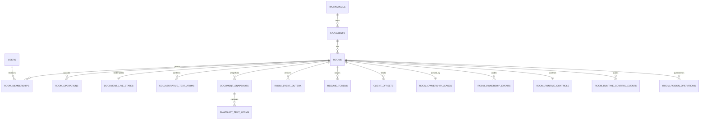

---

## Operation Correctness Model

### Operation envelope

An operation carries:

* `operationId`
* `clientSeq`
* `baseRevision`
* `operationType`
* `operation` JSON payload
* `offline` flag
* `clientOperationId`
* `baseRoomSeq`
* `dependsOnRoomSeq`
* `dependsOnOperationIds`
* `canonicalPayloadHash`

### Accepted operation lifecycle

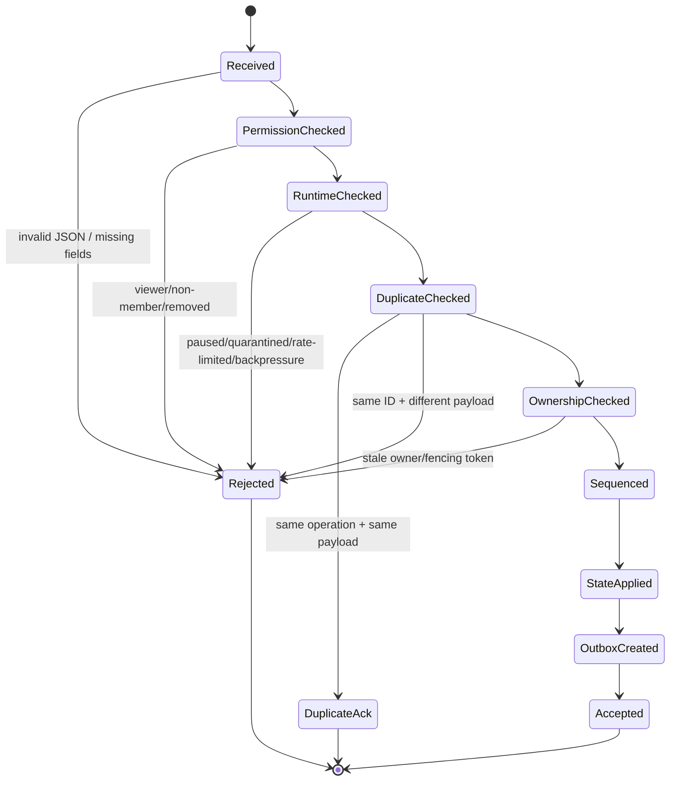

### Key invariants

* Rejected operations do not advance room sequence.
* Rejected operations do not mutate document state.
* Rejected operations do not create outbox rows.
* Duplicate semantic retries do not double-apply.
* Same operation ID with different payload is rejected.
* Accepted operations get exactly one canonical room sequence.
* Accepted operations are replayable.
* Accepted operations that require delivery have outbox rows.

---

## Text Convergence Model

SyncForge uses a pragmatic deterministic text model.

It is inspired by collaborative editing systems, but it intentionally does not claim full CRDT semantics.

### Concepts

| Concept        | Meaning                                                          |
| -------------- | ---------------------------------------------------------------- |
| Text atom/span | Stable unit of inserted text                                     |
| Atom ID        | Deterministic identity derived from operation identity and index |
| Anchor         | `START` or existing atom ID                                      |
| Insert-after   | Insert content after an anchor                                   |
| Tombstone      | Deleted atoms remain stored but hidden                           |
| Visible text   | Ordered non-tombstoned atoms                                     |

### Insert-after model

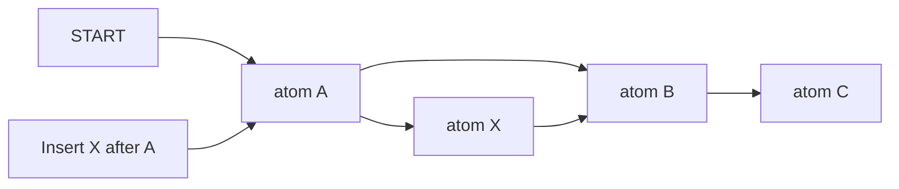

### Tombstone model

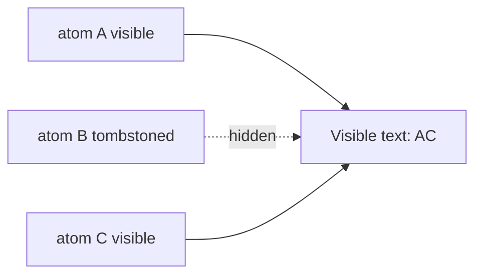

### Convergence invariants

* Same accepted operations produce same visible text.
* Live apply equals full replay.
* Snapshot + active tail replay equals live state.
* Tombstoned text does not reappear after replay or repair.
* Duplicate insert retry does not duplicate atoms.
* Duplicate delete retry is safe.
* Invalid anchor is rejected safely.
* Offline accepted text operations participate in convergence.

---

## Delivery Truth and Redis Streams

SyncForge separates **accepted state** from **live delivery**.

### Why an outbox exists

Without an outbox, this failure can happen:

```text
DB commit succeeds
Redis publish fails
client never receives event
system cannot prove what happened
```

With an outbox:

```text
DB commit succeeds
outbox row exists
Redis publish can retry
client can also backfill from DB truth
```

### Delivery states

Typical outbox states include:

* pending
* retry
* published
* parked/stalled when applicable

### Redis Streams role

Redis Streams are used for:

* room event distribution
* multi-node fanout
* stream offset tracking
* duplicate event handling

Redis Streams are **not** canonical operation truth.

### Outbox failure handling

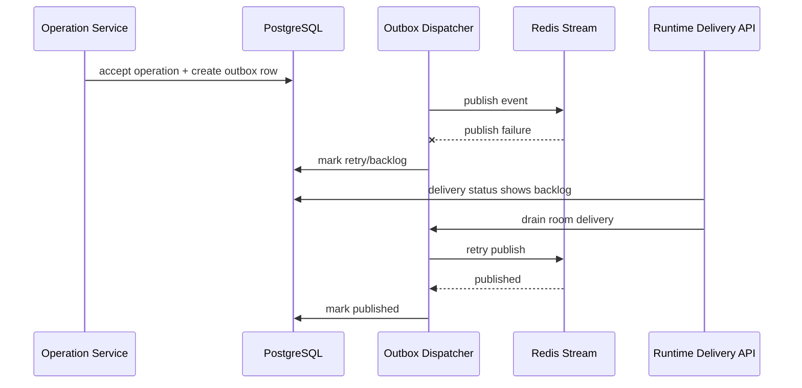

---

## Offline Operation Safety

Offline clients can submit operations later, but not blindly.

The server checks:

* canonical payload hash
* base revision
* base room sequence
* dependencies by room sequence
* dependencies by operation IDs
* current permission
* operation idempotency
* conflict/staleness safety

### Offline operation flow

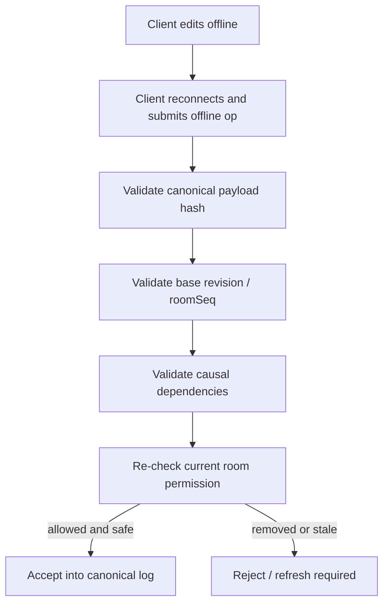

Important rule:

> Permission is checked at submit/resume time, not only when the client originally connected.

---

## Resume, Snapshot Refresh, Bounded Replay, and Compaction

### Resume decisions

A client can resume when its `fromRoomSeq` is inside the current replay window.

If it is too old, it must refresh from a snapshot/latest baseline.

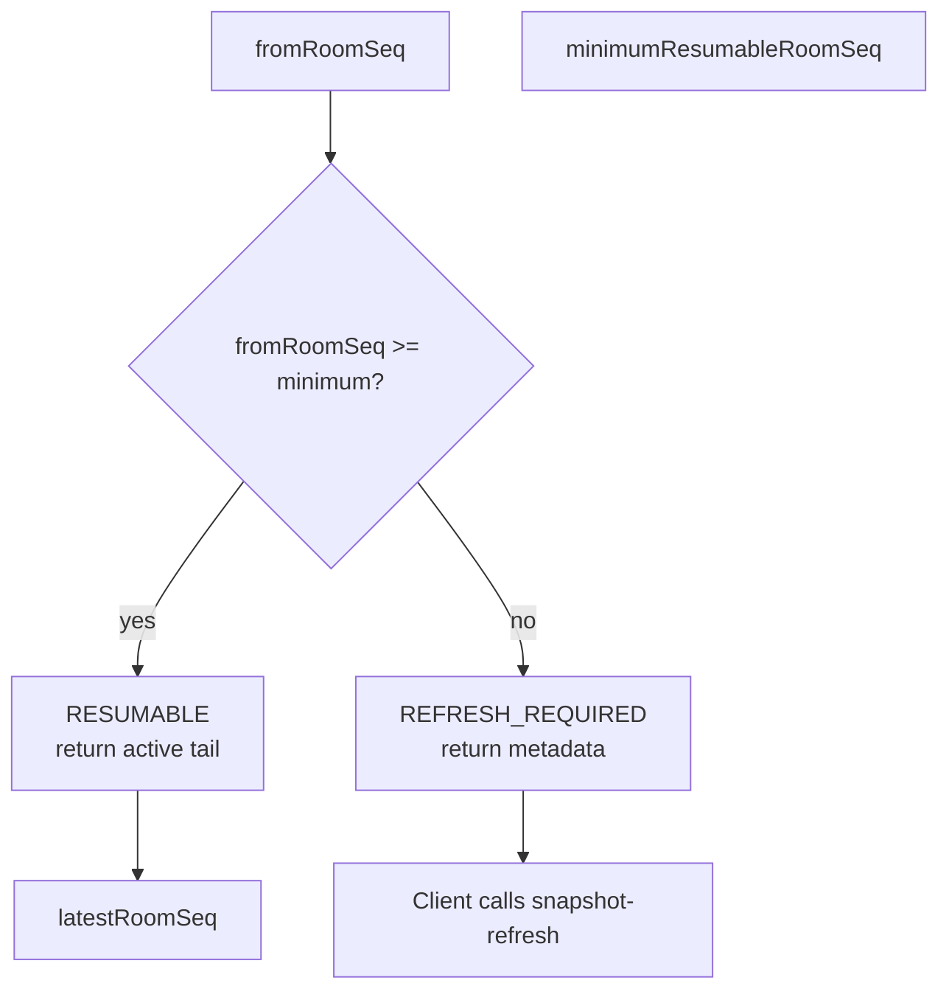

### Snapshot refresh response semantics

Snapshot refresh is the safe baseline path.

It should tell the client:

* visible text/content baseline
* checksum
* `snapshotRoomSeq`
* `minimumResumableRoomSeq`
* `latestRoomSeq`
* `baselineRoomSeq`
* next resume sequence to store

### Why compaction exists

Without compaction:

```text
Every reconnect might need replay from operation 1 forever.
```

With snapshots and compaction:

```text
latest snapshot + active tail = current state
old safe history can be compacted
clients older than the window refresh instead of replaying forever
```

### Compaction safety

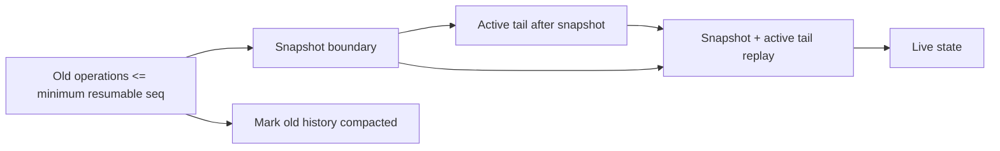

Compaction must preserve:

* idempotency metadata
* snapshot replay correctness
* tombstone hiding
* active tail resumability

---

## Room Ownership, Leases, Fencing, and Failover

Room ownership prevents multiple nodes from writing for the same room at the same time.

### Concepts

| Concept       | Meaning                                                     |
| ------------- | ----------------------------------------------------------- |
| Owner node    | Node currently allowed to write for a room                  |
| Lease         | DB-backed ownership record with expiry                      |
| Fencing token | Monotonic generation number for room ownership              |
| Takeover      | New node acquiring ownership after expiry/release           |
| Stale owner   | Old node attempting to write/publish after losing ownership |

### Why fencing exists

Without fencing:

```text
Node A thinks it owns room
Node B takes over
Node A still writes
Two nodes may assign roomSeq / publish invalid events
```

With fencing:

```text
Node B gets newer token
Node A token is stale
Node A writes are rejected before mutation
```

### Write path with fencing

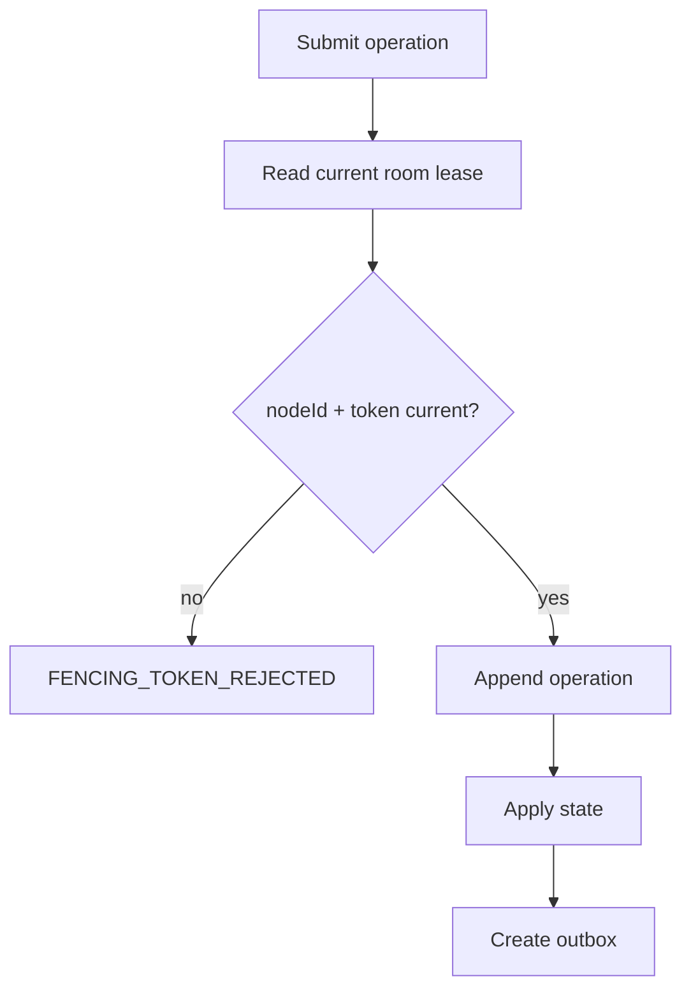

### Failover path

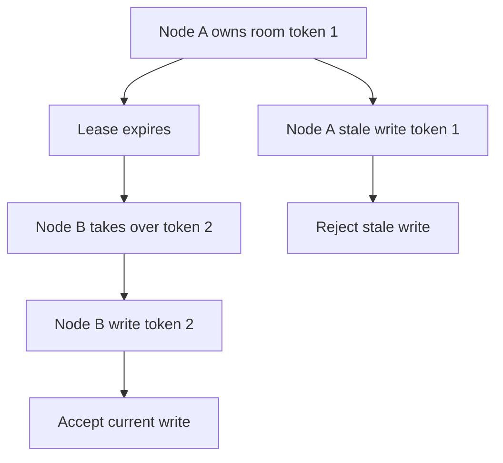

---

## Runtime Control Plane

The runtime layer exists for production-style room operation.

It answers:

* Is this room healthy?
* Is replay still correct?
* Is delivery stuck?
* Is ownership coherent?
* Should clients resync?
* Should writes be paused?
* Is repair required?
* Can state be rebuilt from canonical truth?

### Runtime overview

```text
GET /api/v1/rooms/{roomId}/runtime?userId={ownerUserId}
```

Aggregates:

* health status
* invariant status
* delivery status
* ownership status
* resume window
* snapshot boundary
* compaction preview
* runtime control state
* poison operation count
* recommended action

### Runtime health statuses

| Status            | Meaning                                     |
| ----------------- | ------------------------------------------- |
| `HEALTHY`         | Room appears consistent and operational     |
| `DEGRADED`        | Room has backlog/pressure but is not broken |
| `PAUSED`          | Writes are paused by runtime control        |
| `RESYNC_REQUIRED` | Clients should refresh/resync from baseline |
| `REPAIR_REQUIRED` | State requires operator repair/rebuild      |

### Recommended actions

| Action                      | Meaning                                |
| --------------------------- | -------------------------------------- |
| `NONE`                      | No action needed                       |
| `FORCE_RESYNC`              | Clients should refresh/rejoin baseline |
| `DRAIN_OUTBOX`              | Delivery backlog should be drained     |
| `PAUSE_AND_REPAIR`          | Stop writes and rebuild/repair state   |
| `SNAPSHOT_REFRESH_REQUIRED` | Snapshot baseline should be refreshed  |

---

## Consistency Verification and Repair

### Verifier checks

The consistency verifier checks room invariants including:

* roomSeq values are gapless
* roomSeq values are unique
* operation IDs are unique per room
* document state sequence matches accepted operation log
* document state revision matches accepted operation log
* document state checksum matches visible text
* text atoms materialize to document state content
* snapshot + active tail replay equals live visible text
* accepted operations have delivery outbox rows
* ownership/fencing metadata is coherent
* resume window boundaries are coherent

### Invariant response shape

```json
{
  "roomId": "...",
  "status": "PASS",
  "checkedAt": "2026-04-27T00:00:00Z",
  "latestRoomSeq": 42,
  "latestRevision": 42,
  "violationCount": 0,
  "violations": []
}
```

### Violation shape

```json
{
  "code": "TEXT_MATERIALIZATION_MISMATCH",
  "severity": "ERROR",
  "message": "text atoms must materialize to document state content",
  "expected": "Hello",
  "actual": "Hllo",
  "relatedRoomSeq": 12,
  "recommendedAction": "PAUSE_AND_REPAIR"
}
```

### Repair/rebuild behavior

Repair/rebuild:

* requires manage-level room permission
* pauses writes or requires safe paused state
* rebuilds from latest snapshot + active tail when possible
* falls back to canonical operation log when no snapshot exists
* verifies checksum
* clears repair-required only on success
* does not mutate operation log
* does not delete outbox rows
* preserves ownership state
* keeps writes paused until explicitly resumed

---

## Failure Testing and Jepsen-Lite Matrix

SyncForge includes deterministic failure tests.

This is not formal Jepsen.

It is a **Jepsen-lite deterministic failure matrix** for project-level confidence.

### Failure matrix areas

| Scenario                       | What it proves                                                                    |
| ------------------------------ | --------------------------------------------------------------------------------- |
| Outbox publish failure         | Accepted operation is not lost; drain can recover delivery                        |
| Duplicate stream event         | Duplicate Redis/fanout event does not create duplicate canonical state            |
| Stale owner write              | Old fencing token cannot mutate room state                                        |
| Stale owner publish            | Old owner cannot safely publish invalid events                                    |
| Same-node old token            | Reacquired node must still reject old token writes                                |
| Snapshot + compaction + repair | Compacted history not required; snapshot atoms + active tail repair state         |
| Permission removal             | Removed users cannot access resume/backfill/state/runtime paths                   |
| Poison operation               | Repeated replay/materialization failure is quarantined and marked repair-required |
| Runtime pause                  | Paused writes block mutation but allow read/resume paths                          |
| Final nightmare scenario       | Multiple failures combined still preserve canonical invariants                    |

### Final nightmare scenario

The flagship test covers:

1. Create workspace/document/room.
2. Owner/editor/viewer exist.
3. Node A owns the room.
4. Owner writes initial text.
5. Editor writes text.
6. Offline accepted edit is submitted.
7. Duplicate retry occurs.
8. Snapshot is created.
9. Tombstone delete occurs.
10. Compaction runs.
11. Outbox publish fails once.
12. Duplicate stream event occurs.
13. Node A lease expires / Node B takes over.
14. Node A stale write is rejected.
15. Node A stale publish is rejected/recorded.
16. Viewer is removed.
17. Removed viewer attempts recovery/runtime paths and is denied.
18. Room writes are paused.
19. Force-resync generation increments.
20. Document drift is injected.
21. Verifier detects drift.
22. Repair rebuilds from snapshot + active tail.
23. Delivery drain completes.
24. Writes resume.
25. Authorized editor resumes and sees canonical state.
26. Final visible text equals expected.
27. Replay equivalence holds.
28. RoomSeq is gapless.
29. No duplicate roomSeq.
30. No duplicate accepted operation.
31. No unauthorized operation is leaked.
32. Final invariant verifier passes.

---

## Testing Strategy

SyncForge has a large backend test suite focused on behavior, invariants, and runtime proof.

### Test layers

| Layer            | Examples                                                     |
| ---------------- | ------------------------------------------------------------ |
| Foundation tests | app boot, migrations, room/domain setup                      |
| Protocol tests   | WebSocket join/resume/operation protocol                     |
| Operation tests  | idempotency, duplicate safety, sequence invariants           |
| Text tests       | stable IDs, insert-after ordering, tombstones                |
| Replay tests     | full replay, snapshot equivalence, bounded replay            |
| Delivery tests   | outbox transactionality, Redis publish retry, stream offsets |
| Offline tests    | canonical hash, causal dependencies, stale snapshots         |
| Runtime tests    | health, pause/resume, force-resync, repair                   |
| Ownership tests  | leases, fencing, takeover, stale owner rejection             |
| Failure tests    | Jepsen-lite matrix and nightmare scenario                    |
| Docker tests     | normal Compose and two-node Compose validation               |

### CI workflow

The backend hardening workflow runs:

* targeted SyncForge backend tests
* backend compile
* normal Docker Compose validation
* two-node Docker Compose validation

This keeps final proof in CI without forcing full Docker runtime smoke on every run.

---

## Verification Commands

### Focused final proof tests

```bash
cd apps/api
./mvnw "-Dtest=*Pr14*,*JepsenLite*,*Nightmare*,*TwoNode*,*FailureMatrix*,*Poison*,*RepairRebuildHardening*,*ConsistencyVerifierHardening*" test
```

### Full tests

```bash
cd apps/api
./mvnw test
```

### Compile

```bash
cd apps/api
./mvnw -DskipTests compile
```

### Normal Compose config

```bash
docker compose -f infra/docker-compose/docker-compose.yml config
```

### Two-node Compose config

```bash
docker compose -f infra/docker-compose/docker-compose.two-node.yml config
```

### Normal runtime smoke

```bash
docker compose -f infra/docker-compose/docker-compose.yml up -d --build
curl -s http://localhost:8080/actuator/health
curl -s http://localhost:8080/actuator/health/readiness
curl -s http://localhost:8080/api/v1/system/ping
curl -s http://localhost:8080/api/v1/system/node
docker compose -f infra/docker-compose/docker-compose.yml down -v
```

### Two-node runtime smoke

```bash
./infra/docker-compose/smoke-two-node-runtime.sh
```

Or manually:

```bash
docker compose -f infra/docker-compose/docker-compose.two-node.yml up -d --build
curl -s http://localhost:8080/api/v1/system/node
curl -s http://localhost:8081/api/v1/system/node
docker compose -f infra/docker-compose/docker-compose.two-node.yml down -v
```

---

## Operational Playbooks

### Playbook: client is too far behind

Symptoms:

* resume returns `REFRESH_REQUIRED`
* `fromRoomSeq < minimumResumableRoomSeq`

Response:

1. Client calls snapshot refresh.
2. Client stores returned baseline room sequence.
3. Client resumes from new baseline later.

### Playbook: delivery backlog

Symptoms:

* runtime delivery shows backlog/retry
* runtime overview recommends `DRAIN_OUTBOX`

Response:

```bash
curl -X POST "http://localhost:8080/api/v1/rooms/{roomId}/runtime/delivery/drain?userId={ownerUserId}"
```

Then verify:

```bash
curl "http://localhost:8080/api/v1/rooms/{roomId}/runtime/delivery?userId={ownerUserId}"
```

### Playbook: room state drift detected

Symptoms:

* invariant API returns `FAIL`
* runtime overview recommends `PAUSE_AND_REPAIR`

Response:

1. Pause writes.
2. Rebuild state.
3. Verify invariants.
4. Resume writes only after repair succeeds.

```bash
curl -X POST "http://localhost:8080/api/v1/rooms/{roomId}/runtime/pause?userId={ownerUserId}" \
  -H 'Content-Type: application/json' \
  -d '{"reason":"invariant failure"}'

curl -X POST "http://localhost:8080/api/v1/rooms/{roomId}/runtime/repair/rebuild-state?userId={ownerUserId}" \
  -H 'Content-Type: application/json' \
  -d '{"reason":"rebuild from canonical truth"}'

curl "http://localhost:8080/api/v1/rooms/{roomId}/runtime/invariants?userId={ownerUserId}"

curl -X POST "http://localhost:8080/api/v1/rooms/{roomId}/runtime/resume-writes?userId={ownerUserId}" \
  -H 'Content-Type: application/json' \
  -d '{"reason":"repair complete"}'
```

### Playbook: stale owner detected

Symptoms:

* stale owner write returns `FENCING_TOKEN_REJECTED`
* ownership audit shows rejected stale owner event

Response:

1. Check room ownership status/audit.
2. Verify current owner node.
3. Verify invariants.
4. Resume normal operation if invariant verifier passes.

### Playbook: poison operation detected

Symptoms:

* poison operation appears in runtime API
* runtime health becomes `REPAIR_REQUIRED`

Response:

1. Pause writes.
2. Inspect poison operations.
3. Repair/rebuild state.
4. Verify invariants.
5. Resume writes after successful repair.

---

## Known Boundaries

SyncForge intentionally does **not** claim:

* full Google Docs editing semantics
* full academic CRDT correctness
* real Jepsen distributed-systems proof
* production authentication / OAuth
* multi-region deployment
* Kubernetes readiness
* frontend editor UX
* rich text support
* comments or mentions
* payment/subscription/marketplace logic
* ranking/recommendation/search product logic

The project is a backend correctness and systems-design project focused on collaboration state, replay, delivery, and runtime recovery.

### Honest wording

Good wording:

```text
SyncForge uses a deterministic collaborative text model with stable text atoms, insert-after semantics, tombstones, and replay equivalence tests.
```

Avoid overclaiming:

```text
SyncForge is a complete CRDT replacement for Google Docs.
```

Good wording:

```text
SyncForge includes a Jepsen-lite deterministic failure matrix.
```

Avoid overclaiming:

```text
SyncForge has been formally verified by Jepsen.
```

---

## Final Backend Feature Stop Line

Backend feature work should stop here.

The remaining useful work is not more backend feature development.

The next useful work is:

* clearer README polish
* architecture diagrams
* ADRs
* demo walkthrough
* interview story pack
* API examples
* short video demo
* deployment notes if needed

The backend already has enough feature depth:

```text
WebSocket collaboration
+ ordered operations
+ durable delivery
+ offline safety
+ text convergence
+ bounded replay
+ compaction
+ room ownership / fencing / failover
+ runtime verification / repair
+ two-node proof
+ Jepsen-lite failure matrix
```

Adding more backend features now would reduce clarity.

The strongest next step is packaging the system so another engineer can understand the architecture quickly and trust the proof.

---

## Project Summary

SyncForge is a realtime collaboration backend that treats correctness as the product.

It is designed around these ideas:

* accepted operations are canonical
* DB truth beats live delivery
* delivery can retry
* clients can recover
* text can be replayed deterministically
* history can be compacted safely
* stale owners are fenced
* runtime state can be inspected
* bad rooms can be paused and repaired
* removed users cannot recover old data
* failure scenarios are tested explicitly

The final technical claim is simple:

> SyncForge can accept collaborative edits, order them, deliver them, replay them, compact them, recover them, and protect them across reconnects, retries, stale nodes, and runtime failure paths.
